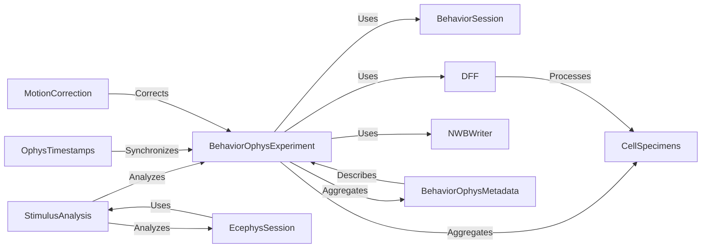

## Details

The `Brain Observatory Data & Analysis` component is a specialized subsystem within the `allensdk` project, designed for the comprehensive processing, analysis, and management of data from Brain Observatory experiments, specifically focusing on calcium imaging and behavioral data. It embodies the "Layered Architecture," "Modular Architecture," and "Data-Centric Architecture" patterns, providing a robust framework for neuroinformatics research.

### BehaviorOphysExperiment

This is the central orchestrator and high-level data aggregator for combined behavioral and optical physiology (ophys) experiments. It serves as the primary interface for users to access, manage, and process all data related to a single experiment, aligning with the "Unified Data Access API" and "Pipeline/Workflow Pattern."

**Related Classes/Methods**:

- <a href="https://github.com/AllenInstitute/AllenSDK/blob/master/allensdk/brain_observatory/behavior/behavior_ophys_experiment.py#L49-L763" target="_blank" rel="noopener noreferrer">`BehaviorOphysExperiment` (49:763)</a>

### BehaviorSession

A foundational data object encapsulating core behavioral data and metadata for a single session, such as licks, rewards, running speed, and stimulus presentations. It's a critical building block that `BehaviorOphysExperiment` leverages to integrate behavioral data with ophys recordings, supporting the "Data-Centric Architecture."

**Related Classes/Methods**:

- <a href="https://github.com/AllenInstitute/AllenSDK/blob/master/allensdk/brain_observatory/behavior/behavior_session.py#L82-L1678" target="_blank" rel="noopener noreferrer">`BehaviorSession` (82:1678)</a>

### CellSpecimens

Manages detailed data related to individual cell specimens identified in calcium imaging experiments. This includes their corrected fluorescence traces, demixed traces, dF/F traces, and detected events, making it a crucial data component for cellular-level analysis within the "Experimental Data Processing Modules."

**Related Classes/Methods**:

- <a href="https://github.com/AllenInstitute/AllenSDK/blob/master/allensdk/brain_observatory/behavior/data_objects/cell_specimens/cell_specimens.py#L135-L895" target="_blank" rel="noopener noreferrer">`CellSpecimens` (135:895)</a>

### StimulusAnalysis

Provides a unified interface for analyzing neuronal responses to various visual stimuli presented during experiments. It's a key "Experimental Data Processing Module" and "Behavioral Analysis Module," central to extracting scientific insights from stimulus-response data. Its extensibility is shown through its inheritance by specific stimulus types.

**Related Classes/Methods**:

- <a href="https://github.com/AllenInstitute/AllenSDK/blob/master/allensdk/brain_observatory/stimulus_analysis.py#L47-L648" target="_blank" rel="noopener noreferrer">`StimulusAnalysis` (47:648)</a>

### DFF

This module contains core functions for calculating dF/F (change in fluorescence over baseline fluorescence), a fundamental preprocessing metric in calcium imaging used to represent neuronal activity. It's a crucial step in the "Pipeline/Workflow Pattern" for preparing calcium imaging data for analysis.

**Related Classes/Methods**:

- `DFF` (1:1)

### NWBWriter

A utility component responsible for writing experimental data to the Neurodata Without Borders (NWB) format. This is essential for promoting data sharing, interoperability, and reproducibility, aligning with "Core Utilities and Data Standards Integration" and the "API Gateway/Client Pattern" for data output.

**Related Classes/Methods**:

- `NWBWriter` (1:1)

### OphysTimestamps

Manages timestamps for optical physiology data, which are critical for accurately synchronizing neural activity with behavioral events and stimulus presentations. This component ensures precise temporal alignment across different data streams, a foundational requirement for accurate neuroscientific analysis.

**Related Classes/Methods**:

- <a href="https://github.com/AllenInstitute/AllenSDK/blob/master/allensdk/brain_observatory/behavior/data_objects/timestamps/ophys_timestamps.py#L13-L66" target="_blank" rel="noopener noreferrer">`OphysTimestamps` (13:66)</a>

### MotionCorrection

Handles motion correction data, which is vital for stabilizing calcium imaging recordings by correcting for movement artifacts. This preprocessing step ensures the spatial alignment of imaging data, critical for accurate downstream analysis and fitting into "Experimental Data Processing Modules."

**Related Classes/Methods**:

- <a href="https://github.com/AllenInstitute/AllenSDK/blob/master/allensdk/brain_observatory/behavior/data_objects/motion_correction.py#L13-L68" target="_blank" rel="noopener noreferrer">`MotionCorrection` (13:68)</a>

### BehaviorOphysMetadata

Encapsulates comprehensive metadata specific to combined behavioral and ophys experiments, including details about the experiment setup, subject information, and recording parameters. This component ensures that all relevant contextual information is associated with the experimental data, supporting scientific rigor and data accessibility.

**Related Classes/Methods**:

- <a href="https://github.com/AllenInstitute/AllenSDK/blob/master/allensdk/brain_observatory/behavior/data_objects/metadata/behavior_ophys_metadata.py#L28-L216" target="_blank" rel="noopener noreferrer">`BehaviorOphysMetadata` (28:216)</a>

### EcephysSession

Represents an electrophysiology (ephys) recording session, providing access to various ephys data (LFP, units) and leveraging lazy loading for efficiency. Its interaction with `StimulusAnalysis` indicates that the SDK's analysis capabilities are designed to be shared across different modalities of brain observatory data, highlighting the "Modular Architecture" and extensibility of the SDK.

**Related Classes/Methods**:

- <a href="https://github.com/AllenInstitute/AllenSDK/blob/master/allensdk/brain_observatory/ecephys/ecephys_session.py#L33-L1373" target="_blank" rel="noopener noreferrer">`EcephysSession` (33:1373)</a>

### [FAQ](https://github.com/CodeBoarding/GeneratedOnBoardings/tree/main?tab=readme-ov-file#faq)