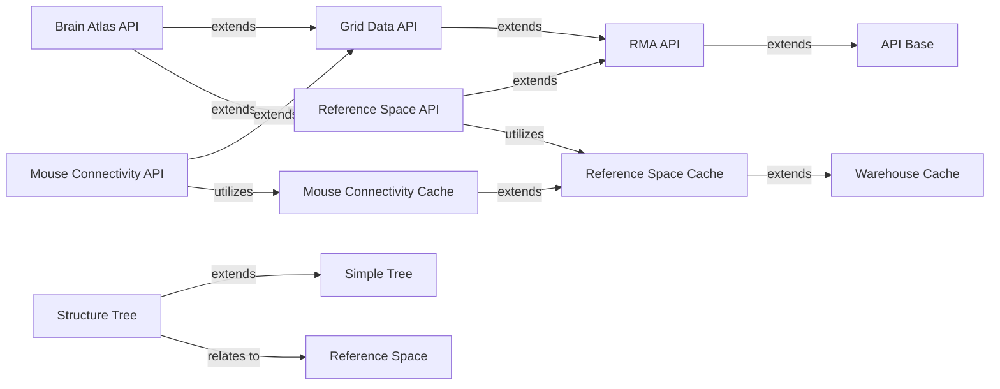

## Details

One paragraph explaining the functionality which is represented by this graph. What the main flow is and what is its purpose.

### Brain Atlas API

Provides programmatic access to mouse brain atlas data, including anatomical structures and their spatial coordinates.

**Related Classes/Methods**:

- <a href="https://github.com/AllenInstitute/AllenSDK/blob/master/allensdk/api/queries/mouse_atlas_api.py#L45-L149" target="_blank" rel="noopener noreferrer">`allensdk.api.queries.mouse_atlas_api.MouseAtlasApi` (45:149)</a>

### Mouse Connectivity API

Offers an interface to query and retrieve mouse brain connectivity data, including projection volumes and injection site information.

**Related Classes/Methods**:

- <a href="https://github.com/AllenInstitute/AllenSDK/blob/master/allensdk/api/queries/mouse_connectivity_api.py#L43-L504" target="_blank" rel="noopener noreferrer">`allensdk.api.queries.mouse_connectivity_api.MouseConnectivityApi` (43:504)</a>

### Reference Space Cache

Manages the caching and retrieval of standardized brain reference spaces, ensuring consistent anatomical context for data.

**Related Classes/Methods**:

- <a href="https://github.com/AllenInstitute/AllenSDK/blob/master/allensdk/core/reference_space_cache.py#L46-L329" target="_blank" rel="noopener noreferrer">`allensdk.core.reference_space_cache.ReferenceSpaceCache` (46:329)</a>

### Mouse Connectivity Cache

Caches and provides efficient access to mouse connectivity datasets, optimizing performance for repeated data requests.

**Related Classes/Methods**:

- <a href="https://github.com/AllenInstitute/AllenSDK/blob/master/allensdk/core/mouse_connectivity_cache.py#L53-L977" target="_blank" rel="noopener noreferrer">`allensdk.core.mouse_connectivity_cache.MouseConnectivityCache` (53:977)</a>

### Structure Tree

Represents the hierarchical organization of brain anatomical structures, allowing for navigation and querying of brain regions.

**Related Classes/Methods**:

- <a href="https://github.com/AllenInstitute/AllenSDK/blob/master/allensdk/core/structure_tree.py#L47-L456" target="_blank" rel="noopener noreferrer">`allensdk.core.structure_tree.StructureTree` (47:456)</a>

### Grid Data API

A foundational API for retrieving grid-based volumetric data, serving as a base for more specific data APIs like the mouse atlas and connectivity APIs.

**Related Classes/Methods**:

- <a href="https://github.com/AllenInstitute/AllenSDK/blob/master/allensdk/api/queries/grid_data_api.py#L41-L251" target="_blank" rel="noopener noreferrer">`allensdk.api.queries.grid_data_api.GridDataApi` (41:251)</a>

### Reference Space API

Provides an API for querying information about standardized reference spaces, such as coordinate systems and transformations.

**Related Classes/Methods**:

- <a href="https://github.com/AllenInstitute/AllenSDK/blob/master/allensdk/api/queries/reference_space_api.py#L44-L291" target="_blank" rel="noopener noreferrer">`allensdk.api.queries.reference_space_api.ReferenceSpaceApi` (44:291)</a>

### RMA API

A general-purpose API for interacting with the Allen Institute's Resource Management Application (RMA), serving as a base for many specific data APIs within the SDK.

**Related Classes/Methods**:

- <a href="https://github.com/AllenInstitute/AllenSDK/blob/master/allensdk/api/queries/rma_api.py#L39-L599" target="_blank" rel="noopener noreferrer">`allensdk.api.queries.rma_api.RmaApi` (39:599)</a>

### API Base

The foundational base class for all API clients in the allensdk, providing common functionalities like request handling, authentication, and error management.

**Related Classes/Methods**:

- <a href="https://github.com/AllenInstitute/AllenSDK/blob/master/allensdk/api/api.py#L52-L393" target="_blank" rel="noopener noreferrer">`allensdk.api.api.Api` (52:393)</a>

### Warehouse Cache

A generic caching mechanism used by various data caches across the SDK to store and retrieve data efficiently, reducing redundant network requests.

**Related Classes/Methods**:

- <a href="https://github.com/AllenInstitute/AllenSDK/blob/master/allensdk/api/warehouse_cache/cache.py#L93-L585" target="_blank" rel="noopener noreferrer">`allensdk.api.warehouse_cache.cache.Cache` (93:585)</a>

### Simple Tree

A foundational data structure representing a generic tree, providing basic tree traversal and manipulation functionalities.

**Related Classes/Methods**:

- <a href="https://github.com/AllenInstitute/AllenSDK/blob/master/allensdk/core/simple_tree.py#L43-L397" target="_blank" rel="noopener noreferrer">`allensdk.core.simple_tree.SimpleTree` (43:397)</a>

### Reference Space

Defines a standardized coordinate system or anatomical context for brain data, enabling consistent data integration and analysis.

**Related Classes/Methods**:

- <a href="https://github.com/AllenInstitute/AllenSDK/blob/master/allensdk/core/reference_space.py#L50-L416" target="_blank" rel="noopener noreferrer">`allensdk.core.reference_space.ReferenceSpace` (50:416)</a>

### [FAQ](https://github.com/CodeBoarding/GeneratedOnBoardings/tree/main?tab=readme-ov-file#faq)