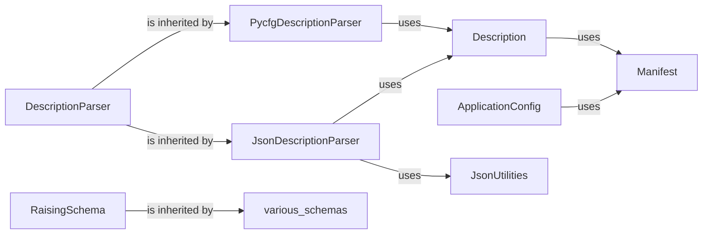

## Details

The `Configuration & Schema Management` subsystem is crucial for the `allensdk` project, a Neuroinformatics Software Development Kit (SDK). It provides a robust and flexible framework for managing application settings, defining experimental parameters, and ensuring data integrity through schema validation. This aligns with the SDK's architectural bias towards scientific rigor, data accessibility, and extensibility. These components are fundamental because they establish the backbone for how the SDK consumes, interprets, and validates input parameters and data structures. In a neuroinformatics SDK, where data integrity and reproducibility are paramount, a robust configuration and schema management system ensures that complex experimental setups and analysis pipelines are consistently defined and executed, minimizing errors and facilitating reliable scientific outcomes.

### ApplicationConfig

This component serves as the primary interface for managing the SDK's overall application configuration. It is responsible for loading settings from diverse sources, including environment variables, command-line arguments, and JSON files. This hierarchical approach to configuration management is vital for allowing users and developers to customize application behavior and processing parameters without altering the core codebase, promoting flexibility and reproducibility in neuroinformatics workflows.

**Related Classes/Methods**:

- <a href="https://github.com/AllenInstitute/AllenSDK/blob/master/allensdk/config/app/application_config.py#L1-L1" target="_blank" rel="noopener noreferrer">`allensdk/config/app/application_config.py` (1:1)</a>

### Manifest

The `Manifest` acts as a central registry for managing file and directory paths within the SDK. It facilitates loading configuration files, adding individual files or entire directories, and resolving paths to ensure consistent and reliable access to data and resources. This component is fundamental for promoting reproducibility and ease of data management, which are critical aspects of neuroinformatics pipelines.

**Related Classes/Methods**:

- <a href="https://github.com/AllenInstitute/AllenSDK/blob/master/allensdk/config/manifest.py#L1-L1" target="_blank" rel="noopener noreferrer">`allensdk/config/manifest.py` (1:1)</a>

### Description

This component provides a structured, higher-level representation of the overall configuration for neuroinformatics experiments or analysis workflows. It defines the schema and structure for complex data, often incorporating and unpacking information managed by the `Manifest`. Its role is to ensure data integrity and proper interpretation of experimental parameters and results.

**Related Classes/Methods**:

- <a href="https://github.com/AllenInstitute/AllenSDK/blob/master/allensdk/config/model/description.py#L1-L1" target="_blank" rel="noopener noreferrer">`allensdk/config/model/description.py` (1:1)</a>

### DescriptionParser

As an abstract base component, `DescriptionParser` defines a standardized interface for parsing configuration descriptions from various formats. This abstraction promotes extensibility, allowing the SDK to support different configuration file types (e.g., JSON, Python config files) without requiring modifications to the core configuration logic. This is a key pattern for a modular SDK.

**Related Classes/Methods**:

- <a href="https://github.com/AllenInstitute/AllenSDK/blob/master/allensdk/config/model/description_parser.py#L1-L1" target="_blank" rel="noopener noreferrer">`allensdk/config/model/description_parser.py` (1:1)</a>

### JsonDescriptionParser

This is a concrete implementation of the `DescriptionParser` specifically designed to parse configuration descriptions from JSON files. It deserializes structured JSON configuration data into usable Python objects, leveraging `JsonUtilities` for robust JSON handling. Given the prevalence of JSON in data exchange, this component is essential for integrating with various data sources and tools.

**Related Classes/Methods**:

- <a href="https://github.com/AllenInstitute/AllenSDK/blob/master/allensdk/config/model/formats/json_description_parser.py#L1-L1" target="_blank" rel="noopener noreferrer">`allensdk/config/model/formats/json_description_parser.py` (1:1)</a>

### PycfgDescriptionParser

Another concrete implementation of `DescriptionParser`, this component handles parsing configuration descriptions from Python-specific configuration formats (e.g., `.cfg` files or Python modules). This provides flexibility in how configurations are defined and loaded, catering to different preferences or existing conventions within the Python ecosystem.

**Related Classes/Methods**:

- <a href="https://github.com/AllenInstitute/AllenSDK/blob/master/allensdk/config/model/formats/pycfg_description_parser.py#L1-L1" target="_blank" rel="noopener noreferrer">`allensdk/config/model/formats/pycfg_description_parser.py` (1:1)</a>

### RaisingSchema

This foundational utility class, typically inherited by specific schemas throughout the SDK, defines and validates data schemas using `argschema`. It is critical for ensuring consistent input/output formats and robust parameter handling by raising errors for invalid data. This strict validation is paramount for maintaining scientific rigor and data integrity in a neuroinformatics SDK, preventing malformed data from propagating through analysis pipelines.

**Related Classes/Methods**:

- <a href="https://github.com/AllenInstitute/AllenSDK/blob/master/allensdk/brain_observatory/argschema_utilities.py#L1-L1" target="_blank" rel="noopener noreferrer">`allensdk/brain_observatory/argschema_utilities.py` (1:1)</a>

### JsonUtilities

This component provides general utility functions for handling JSON data, including reading and writing JSON files, and specifically handling JSON with comments. It underpins the JSON-based configuration parsing and data serialization across the SDK, ensuring reliable and consistent JSON operations.

**Related Classes/Methods**:

- `allensdk/config/model/json_utilities.py` (1:1)

### [FAQ](https://github.com/CodeBoarding/GeneratedOnBoardings/tree/main?tab=readme-ov-file#faq)