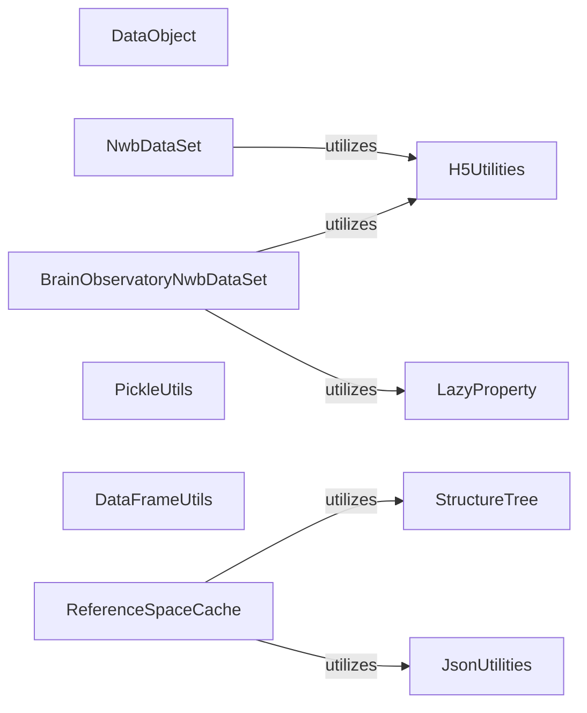

## Details

DataObject indirectly utilizes JsonUtilities, PickleUtils, and DataFrameUtils. While DataObject itself does not directly import or call methods from these utilities, its subclasses or other modules processing DataObject instances might use them for serialization, deserialization, or data manipulation. This suggests a broader ecosystem of data handling where DataObject instances are processed by these utility modules.

### DataObject

The most fundamental base class for all data objects within the SDK. It provides a consistent interface and common functionalities for data representation, serving as the root of a significant portion of the SDK's data model.

**Related Classes/Methods**: _None_

### NwbDataSet

A base class specifically designed for handling Neurodata Without Borders (NWB) formatted datasets. It provides methods for reading and interacting with NWB files, ensuring adherence to community data standards.

**Related Classes/Methods**: _None_

### BrainObservatoryNwbDataSet

A specialized NWB dataset class tailored for Brain Observatory experimental data. It extends NwbDataSet to provide specific functionalities and data access patterns relevant to brain observatory experiments.

**Related Classes/Methods**: _None_

### JsonUtilities

A module containing utility functions for JSON serialization and deserialization. It's widely used across the SDK for configuration, metadata handling, and data interchange.

**Related Classes/Methods**: _None_

### H5Utilities

Provides utility functions for interacting with HDF5 (Hierarchical Data Format 5) files. HDF5 is a common format for storing large numerical datasets and is the underlying technology for NWB files.

**Related Classes/Methods**: _None_

### PickleUtils

Contains utility functions for Python object serialization using the pickle module. This is used for saving and loading Python objects directly, often for caching or intermediate results.

**Related Classes/Methods**: _None_

### DataFrameUtils

Offers utility functions for efficient manipulation and processing of pandas DataFrames, which are extensively used for tabular data throughout the SDK.

**Related Classes/Methods**: _None_

### LazyProperty

Implements a lazy loading pattern for object properties, allowing expensive computations or data loading to be deferred until the property is actually accessed. This optimizes memory usage and performance.

**Related Classes/Methods**: _None_

### StructureTree

A core data structure for representing hierarchical data, such as brain atlases and ontologies, allowing for efficient navigation and querying of anatomical relationships.

**Related Classes/Methods**: _None_

### ReferenceSpaceCache

Caches reference space data, which is often hierarchical and used for anatomical mapping and coordinate transformations. It provides efficient access to commonly used reference data.

**Related Classes/Methods**: _None_

### [FAQ](https://github.com/CodeBoarding/GeneratedOnBoardings/tree/main?tab=readme-ov-file#faq)