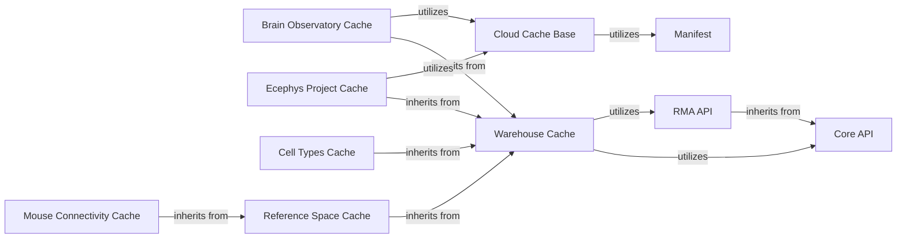

## Details

The Data Access & Caching Layer is a cornerstone of the Allen Institute's Neuroinformatics SDK, designed to provide unified, efficient, and robust access to a wide array of neuroscience datasets. It leverages a layered architecture with specialized caching mechanisms and API clients to optimize data retrieval from both cloud storage (S3) and internal data warehouses (LIMS, Mtrain). This layer is fundamental to the SDK's goal of supporting scientific rigor and data accessibility by abstracting the complexities of data storage and retrieval, allowing researchers to focus on analysis.

### Core API

The foundational abstract class (allensdk.api.api.Api) providing a standardized interface for interacting with various external data sources. It defines common methods for data querying and retrieval, ensuring consistency across different data access points within the SDK.

**Related Classes/Methods**:

- <a href="https://github.com/AllenInstitute/AllenSDK/blob/master/allensdk/api/api.py#L52-L393" target="_blank" rel="noopener noreferrer">`allensdk.api.api.Api` (52:393)</a>

### RMA API

A specialized API client (allensdk.api.queries.rma_api.RmaApi) for querying the Allen Institute's Reference Model Access (RMA) system. RMA is a critical internal data warehouse that provides access to diverse neuroscience datasets and associated metadata.

**Related Classes/Methods**:

- <a href="https://github.com/AllenInstitute/AllenSDK/blob/master/allensdk/api/queries/rma_api.py#L39-L599" target="_blank" rel="noopener noreferrer">`allensdk.api.queries.rma_api.RmaApi` (39:599)</a>

### Cloud Cache Base

An abstract base class (allensdk.api.cloud_cache.cloud_cache.CloudCacheBase) that defines the interface and core logic for managing cached data from cloud storage (e.g., S3) and local file systems. It handles data download, storage, and retrieval, often relying on manifest files for integrity.

**Related Classes/Methods**:

- <a href="https://github.com/AllenInstitute/AllenSDK/blob/master/allensdk/api/cloud_cache/cloud_cache.py#L368-L1034" target="_blank" rel="noopener noreferrer">`allensdk.api.cloud_cache.cloud_cache.CloudCacheBase` (368:1034)</a>

### Manifest

A component (allensdk.api.cloud_cache.manifest.Manifest) responsible for managing metadata about cached files. It ensures data integrity by tracking file versions, locations, and other essential attributes, facilitating efficient lookup and validation of cached data.

**Related Classes/Methods**:

- <a href="https://github.com/AllenInstitute/AllenSDK/blob/master/allensdk/api/cloud_cache/manifest.py#L8-L239" target="_blank" rel="noopener noreferrer">`allensdk.api.cloud_cache.manifest.Manifest` (8:239)</a>

### Warehouse Cache

A generic caching layer (allensdk.api.warehouse_cache.cache.Cache) designed to store and retrieve data from the Allen Institute's internal data warehouses (e.g., LIMS, Mtrain). It provides a unified caching mechanism for various structured data products.

**Related Classes/Methods**:

- <a href="https://github.com/AllenInstitute/AllenSDK/blob/master/allensdk/api/warehouse_cache/cache.py#L93-L585" target="_blank" rel="noopener noreferrer">`allensdk.api.warehouse_cache.cache.Cache` (93:585)</a>

### Brain Observatory Cache

A specialized cache (allensdk.core.BrainObservatoryCache) for accessing and managing experimental data from the Brain Observatory project, including calcium imaging and electrophysiology data. It extends the Warehouse Cache to provide project-specific data access methods.

**Related Classes/Methods**:

- <a href="https://github.com/AllenInstitute/AllenSDK/blob/master/allensdk/core/brain_observatory_cache.py#L79-L819" target="_blank" rel="noopener noreferrer">`allensdk.core.BrainObservatoryCache` (79:819)</a>

### Ecephys Project Cache

A dedicated cache (allensdk.brain_observatory.ecephys.ecephys_project_cache.EcephysProjectCache) for electrophysiology (ecephys) project data. It manages access to sessions, probes, channels, and unit data, extending the Warehouse Cache for specialized ecephys data handling.

**Related Classes/Methods**:

- <a href="https://github.com/AllenInstitute/AllenSDK/blob/master/allensdk/brain_observatory/ecephys/ecephys_project_cache.py#L27-L720" target="_blank" rel="noopener noreferrer">`allensdk.brain_observatory.ecephys.ecephys_project_cache.EcephysProjectCache` (27:720)</a>

### Cell Types Cache

Manages access to data related to cell types (allensdk.core.CellTypesCache), including morphological and electrophysiological characteristics of neurons. It extends the Warehouse Cache to provide specific methods for cell type data.

**Related Classes/Methods**:

- <a href="https://github.com/AllenInstitute/AllenSDK/blob/master/allensdk/core/cell_types_cache.py#L51-L407" target="_blank" rel="noopener noreferrer">`allensdk.core.CellTypesCache` (51:407)</a>

### Reference Space Cache

Provides access to reference brain atlases and spatial data (allensdk.core.reference_space_cache.ReferenceSpaceCache), crucial for mapping and visualizing neuroscience data in a standardized coordinate system. It extends the Warehouse Cache.

**Related Classes/Methods**:

- <a href="https://github.com/AllenInstitute/AllenSDK/blob/master/allensdk/core/reference_space_cache.py#L46-L329" target="_blank" rel="noopener noreferrer">`allensdk.core.reference_space_cache.ReferenceSpaceCache` (46:329)</a>

### Mouse Connectivity Cache

Handles the retrieval and caching of mouse brain connectivity data (allensdk.core.mouse_connectivity_cache.MouseConnectivityCache), including projection mapping and anatomical tracing. It extends the Reference Space Cache to provide connectivity-specific data.

**Related Classes/Methods**:

- <a href="https://github.com/AllenInstitute/AllenSDK/blob/master/allensdk/core/mouse_connectivity_cache.py#L53-L977" target="_blank" rel="noopener noreferrer">`allensdk.core.mouse_connectivity_cache.MouseConnectivityCache` (53:977)</a>

### [FAQ](https://github.com/CodeBoarding/GeneratedOnBoardings/tree/main?tab=readme-ov-file#faq)