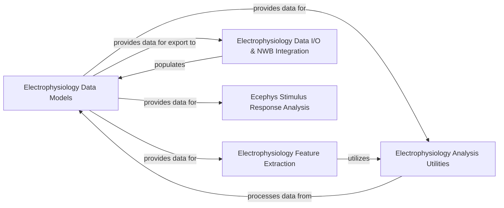

## Details

The `Electrophysiology Data & Analysis` subsystem is a critical part of the Neuroinformatics SDK, providing a comprehensive set of tools for handling electrophysiology (ephys) data. Its architecture is designed to support scientific rigor, data accessibility, and extensibility, aligning with the project's overall architectural biases. These components are fundamental because they collectively address the entire lifecycle of electrophysiology data within the SDK: from defining its structure and enabling its input/output, to performing basic and advanced analyses, and finally, ensuring its standardized representation and interoperability. This modular design supports the SDK's goals of scientific rigor, data accessibility, and extensibility by providing clear responsibilities and well-defined interfaces between components.

### Electrophysiology Data Models

This component defines the canonical data structures for representing electrophysiology recording sessions. It acts as the central hub for organizing and accessing all experimental data, including details about probes, individual channels, sorted neuronal units, Local Field Potentials (LFP), and Current Source Density (CSD). This component is fundamental as it establishes a unified and consistent data representation, which is crucial for a "Data-Centric Architecture" in a scientific SDK.

**Related Classes/Methods**:

- <a href="https://github.com/AllenInstitute/AllenSDK/blob/master/allensdk/brain_observatory/ecephys/ecephys_session.py#L33-L1373" target="_blank" rel="noopener noreferrer">`allensdk.brain_observatory.ecephys.ecephys_session.EcephysSession` (33:1373)</a>

- <a href="https://github.com/AllenInstitute/AllenSDK/blob/master/allensdk/brain_observatory/ecephys/_probe.py#L46-L441" target="_blank" rel="noopener noreferrer">`allensdk.brain_observatory.ecephys._probe.Probe` (46:441)</a>

- <a href="https://github.com/AllenInstitute/AllenSDK/blob/master/allensdk/brain_observatory/ecephys/_channel.py#L8-L103" target="_blank" rel="noopener noreferrer">`allensdk.brain_observatory.ecephys._channel.Channel` (8:103)</a>

- <a href="https://github.com/AllenInstitute/AllenSDK/blob/master/allensdk/brain_observatory/ecephys/_unit.py#L7-L209" target="_blank" rel="noopener noreferrer">`allensdk.brain_observatory.ecephys._unit.Unit` (7:209)</a>

- <a href="https://github.com/AllenInstitute/AllenSDK/blob/master/allensdk/brain_observatory/ecephys/_lfp.py#L8-L105" target="_blank" rel="noopener noreferrer">`allensdk.brain_observatory.ecephys._lfp.LFP` (8:105)</a>

- <a href="https://github.com/AllenInstitute/AllenSDK/blob/master/allensdk/brain_observatory/ecephys/_current_source_density.py#L7-L76" target="_blank" rel="noopener noreferrer">`allensdk.brain_observatory.ecephys._current_source_density.CurrentSourceDensity` (7:76)</a>

### Electrophysiology Feature Extraction

This module provides a comprehensive set of tools for extracting quantitative features from raw electrophysiological recordings. It supports analysis at various levels, from individual voltage traces (sweeps) to aggregated cellular responses, enabling detailed characterization of neuronal activity, including spike properties, pauses, and bursts. This component is fundamental for enabling downstream analysis and aligns with the "Experimental Data Processing Modules" and "Pipeline/Workflow Pattern" by providing distinct processing steps.

**Related Classes/Methods**:

- <a href="https://github.com/AllenInstitute/AllenSDK/blob/master/allensdk/ephys/ephys_extractor.py#L54-L698" target="_blank" rel="noopener noreferrer">`allensdk.ephys.ephys_extractor.EphysSweepFeatureExtractor` (54:698)</a>

- <a href="https://github.com/AllenInstitute/AllenSDK/blob/master/allensdk/ephys/ephys_extractor.py#L701-L836" target="_blank" rel="noopener noreferrer">`allensdk.ephys.ephys_extractor.EphysSweepSetFeatureExtractor` (701:836)</a>

- <a href="https://github.com/AllenInstitute/AllenSDK/blob/master/allensdk/ephys/ephys_extractor.py#L839-L1099" target="_blank" rel="noopener noreferrer">`allensdk.ephys.ephys_extractor.EphysCellFeatureExtractor` (839:1099)</a>

- <a href="https://github.com/AllenInstitute/AllenSDK/blob/master/allensdk/ephys/ephys_features.py" target="_blank" rel="noopener noreferrer">`allensdk.ephys.ephys_features`</a>

### Electrophysiology Data I/O & NWB Integration

This component provides robust mechanisms for accessing and managing Ecephys project data, including caching capabilities for efficient retrieval. It offers various API implementations to connect to different data sources (e.g., internal data warehouses, LIMS systems, or local NWB files). Crucially, it handles the serialization and deserialization of Ecephys data to and from the Neurodata Without Borders (NWB) format, ensuring data standardization and interoperability. This component is fundamental for data accessibility and reproducibility, embodying "Data-Centric Architecture", "Cache-Aside Pattern", and "API Gateway/Client Pattern".

**Related Classes/Methods**:

- <a href="https://github.com/AllenInstitute/AllenSDK/blob/master/allensdk/brain_observatory/ecephys/ecephys_project_cache.py#L27-L720" target="_blank" rel="noopener noreferrer">`allensdk.brain_observatory.ecephys.ecephys_project_cache.EcephysProjectCache` (27:720)</a>

- <a href="https://github.com/AllenInstitute/AllenSDK/blob/master/allensdk/brain_observatory/ecephys/ecephys_project_api/ecephys_project_api.py#L14-L70" target="_blank" rel="noopener noreferrer">`allensdk.brain_observatory.ecephys.ecephys_project_api.ecephys_project_api.EcephysProjectApi` (14:70)</a>

- <a href="https://github.com/AllenInstitute/AllenSDK/blob/master/allensdk/brain_observatory/ecephys/ecephys_project_api/ecephys_project_warehouse_api.py#L12-L344" target="_blank" rel="noopener noreferrer">`allensdk.brain_observatory.ecephys.ecephys_project_api.ecephys_project_warehouse_api.EcephysProjectWarehouseApi` (12:344)</a>

- <a href="https://github.com/AllenInstitute/AllenSDK/blob/master/allensdk/brain_observatory/ecephys/ecephys_project_api/ecephys_project_lims_api.py#L13-L612" target="_blank" rel="noopener noreferrer">`allensdk.brain_observatory.ecephys.ecephys_project_api.ecephys_project_lims_api.EcephysProjectLimsApi` (13:612)</a>

- <a href="https://github.com/AllenInstitute/AllenSDK/blob/master/allensdk/brain_observatory/ecephys/ecephys_project_api/ecephys_project_fixed_api.py#L7-L37" target="_blank" rel="noopener noreferrer">`allensdk.brain_observatory.ecephys.ecephys_project_api.ecephys_project_fixed_api.EcephysProjectFixedApi` (7:37)</a>

- <a href="https://github.com/AllenInstitute/AllenSDK/blob/master/allensdk/brain_observatory/ecephys/ecephys_session_api/ecephys_nwb_session_api.py#L26-L395" target="_blank" rel="noopener noreferrer">`allensdk.brain_observatory.ecephys.ecephys_session_api.ecephys_nwb_session_api.EcephysNwbSessionApi` (26:395)</a>

- <a href="https://github.com/AllenInstitute/AllenSDK/blob/master/allensdk/brain_observatory/ecephys/write_nwb/nwb_writer.py#L15-L90" target="_blank" rel="noopener noreferrer">`allensdk.brain_observatory.ecephys.write_nwb.nwb_writer.BehaviorEcephysNwbWriter` (15:90)</a>

### Electrophysiology Analysis Utilities

This component encompasses fundamental utility functions and helper classes that support various electrophysiology data processing, analysis, and management tasks across the SDK. It provides common functionalities that are leveraged by other higher-level components, including specific calculations like LFP subsampling and current source density estimation. This component is fundamental as it provides reusable building blocks, aligning with the "Core Utilities" pattern.

**Related Classes/Methods**:

- <a href="https://github.com/AllenInstitute/AllenSDK/blob/master/allensdk/brain_observatory/ecephys/utils.py" target="_blank" rel="noopener noreferrer">`allensdk.brain_observatory.ecephys.utils`</a>

- `allensdk.brain_observatory.ecephys.lfp_subsampling`

- `allensdk.brain_observatory.ecephys.current_source_density`

### Ecephys Stimulus Response Analysis

This component provides a modular framework for analyzing neuronal responses to a variety of visual stimuli used in Ecephys experiments. It includes specialized sub-modules for different stimulus types, allowing researchers to quantify and interpret neural activity in response to specific sensory inputs. This component is fundamental for deriving scientific insights from ephys data, exemplifying the "Pipeline/Workflow Pattern" and "Experimental Data Processing Modules".

**Related Classes/Methods**:

- <a href="https://github.com/AllenInstitute/AllenSDK/blob/master/allensdk/brain_observatory/ecephys/stimulus_analysis/stimulus_analysis.py#L18-L601" target="_blank" rel="noopener noreferrer">`allensdk.brain_observatory.ecephys.stimulus_analysis.stimulus_analysis.StimulusAnalysis` (18:601)</a>

- <a href="https://github.com/AllenInstitute/AllenSDK/blob/master/allensdk/brain_observatory/ecephys/stimulus_analysis/dot_motion.py#L14-L215" target="_blank" rel="noopener noreferrer">`allensdk.brain_observatory.ecephys.stimulus_analysis.dot_motion.DotMotion` (14:215)</a>

- <a href="https://github.com/AllenInstitute/AllenSDK/blob/master/allensdk/brain_observatory/ecephys/stimulus_analysis/drifting_gratings.py#L23-L591" target="_blank" rel="noopener noreferrer">`allensdk.brain_observatory.ecephys.stimulus_analysis.drifting_gratings.DriftingGratings` (23:591)</a>

- <a href="https://github.com/AllenInstitute/AllenSDK/blob/master/allensdk/brain_observatory/ecephys/stimulus_analysis/flashes.py#L19-L220" target="_blank" rel="noopener noreferrer">`allensdk.brain_observatory.ecephys.stimulus_analysis.flashes.Flashes` (19:220)</a>

- <a href="https://github.com/AllenInstitute/AllenSDK/blob/master/allensdk/brain_observatory/ecephys/stimulus_analysis/natural_movies.py#L19-L91" target="_blank" rel="noopener noreferrer">`allensdk.brain_observatory.ecephys.stimulus_analysis.natural_movies.NaturalMovies` (19:91)</a>

- <a href="https://github.com/AllenInstitute/AllenSDK/blob/master/allensdk/brain_observatory/ecephys/stimulus_analysis/natural_scenes.py#L14-L155" target="_blank" rel="noopener noreferrer">`allensdk.brain_observatory.ecephys.stimulus_analysis.natural_scenes.NaturalScenes` (14:155)</a>

- <a href="https://github.com/AllenInstitute/AllenSDK/blob/master/allensdk/brain_observatory/ecephys/stimulus_analysis/receptive_field_mapping.py#L17-L439" target="_blank" rel="noopener noreferrer">`allensdk.brain_observatory.ecephys.stimulus_analysis.receptive_field_mapping.ReceptiveFieldMapping` (17:439)</a>

- <a href="https://github.com/AllenInstitute/AllenSDK/blob/master/allensdk/brain_observatory/ecephys/stimulus_analysis/static_gratings.py#L20-L375" target="_blank" rel="noopener noreferrer">`allensdk.brain_observatory.ecephys.stimulus_analysis.static_gratings.StaticGratings` (20:375)</a>

### [FAQ](https://github.com/CodeBoarding/GeneratedOnBoardings/tree/main?tab=readme-ov-file#faq)