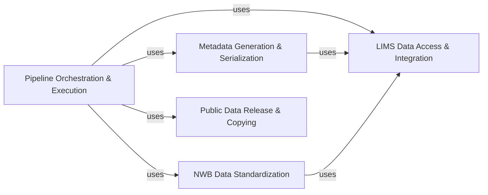

## Details

The `Internal Pipeline & Data Release Tools` subsystem is a critical part of the Neuroinformatics Software Development Kit (SDK), embodying the Pipeline/Workflow, Data-Centric, and Data Standards Integration architectural patterns. It automates the journey of raw experimental data through processing, quality control, and final preparation for public dissemination.

### Pipeline Orchestration & Execution

This component comprises independent Python scripts that serve as distinct stages or workflows within the data processing pipeline. These modules are designed for standalone execution, often within a LIMS environment, and encapsulate specific computational tasks from data transformation and analysis to visualization and metadata generation. It orchestrates the flow of data through various processing steps.

**Related Classes/Methods**:

- <a href="https://github.com/AllenInstitute/AllenSDK/blob/master/allensdk/internal/pipeline_modules/run_observatory_analysis.py#L1-L1" target="_blank" rel="noopener noreferrer">`allensdk.internal.pipeline_modules.run_observatory_analysis` (1:1)</a>

- <a href="https://github.com/AllenInstitute/AllenSDK/blob/master/allensdk/internal/pipeline_modules/run_demixing.py#L1-L1" target="_blank" rel="noopener noreferrer">`allensdk.internal.pipeline_modules.run_demixing` (1:1)</a>

- <a href="https://github.com/AllenInstitute/AllenSDK/blob/master/allensdk/internal/pipeline_modules/run_dff_computation.py#L1-L1" target="_blank" rel="noopener noreferrer">`allensdk.internal.pipeline_modules.run_dff_computation` (1:1)</a>

- <a href="https://github.com/AllenInstitute/AllenSDK/blob/master/allensdk/internal/pipeline_modules/IVSCC/ephys_nwb/extract_nwb_data.py#L1-L1" target="_blank" rel="noopener noreferrer">`allensdk.internal.pipeline_modules.IVSCC.ephys_nwb.extract_nwb_data` (1:1)</a>

### LIMS Data Access & Integration

This layer provides the foundational utilities for interacting with the LIMS (Laboratory Information Management System) database. `PipelineModule` serves as a base class for pipeline stages, managing input/output data serialization/deserialization and integrating with LIMS for file path resolution and metadata updates. `lims_utilities` offers direct query capabilities to LIMS.

**Related Classes/Methods**:

- <a href="https://github.com/AllenInstitute/AllenSDK/blob/master/allensdk/internal/core/lims_pipeline_module.py#L13-L42" target="_blank" rel="noopener noreferrer">`allensdk.internal.core.lims_pipeline_module.PipelineModule` (13:42)</a>

- <a href="https://github.com/AllenInstitute/AllenSDK/blob/master/allensdk/internal/core/lims_utilities.py#L118-L130" target="_blank" rel="noopener noreferrer">`allensdk.internal.core.lims_utilities.query` (118:130)</a>

### Metadata Generation & Serialization

This component is dedicated to generating and writing comprehensive metadata tables for behavioral and optical physiology (ophys) project data. It aggregates information from various sources (e.g., LIMS) and organizes it into standardized tables, which are then written to disk. It also includes schemas for validating the metadata structure.

**Related Classes/Methods**:

- <a href="https://github.com/AllenInstitute/AllenSDK/blob/master/allensdk/brain_observatory/behavior/behavior_project_cache/project_metadata_writer/behavior_project_metadata_writer.py#L47-L215" target="_blank" rel="noopener noreferrer">`allensdk.brain_observatory.behavior.behavior_project_cache.project_metadata_writer.behavior_project_metadata_writer.BehaviorProjectMetadataWriter` (47:215)</a>

- <a href="https://github.com/AllenInstitute/AllenSDK/blob/master/allensdk/brain_observatory/behavior/behavior_project_cache/project_metadata_writer/schemas.py#L135-L166" target="_blank" rel="noopener noreferrer">`allensdk.brain_observatory.behavior.behavior_project_cache.project_metadata_writer.schemas.DataReleaseToolsInputSchema` (135:166)</a>

### NWB Data Standardization

This module is specifically designed for converting processed experimental data into the Neurodata Without Borders (NWB) format. NWB is a widely adopted standardized format for neurophysiology data, making this component crucial for data sharing, interoperability, and reproducibility in neuroinformatics. It leverages a base NWBWriter for consistent output.

**Related Classes/Methods**:

- <a href="https://github.com/AllenInstitute/AllenSDK/blob/master/allensdk/brain_observatory/ecephys/write_nwb/nwb_writer.py#L15-L90" target="_blank" rel="noopener noreferrer">`allensdk.brain_observatory.ecephys.write_nwb.nwb_writer.BehaviorEcephysNwbWriter` (15:90)</a>

- <a href="https://github.com/AllenInstitute/AllenSDK/blob/master/allensdk/brain_observatory/ecephys/write_nwb/__main__.py#L396-L498" target="_blank" rel="noopener noreferrer">`allensdk.brain_observatory.ecephys.write_nwb.__main__.write_ecephys_nwb` (396:498)</a>

### Public Data Release & Copying

This component provides essential utilities for preparing and copying processed data and associated files for public release. It ensures that data is correctly moved, organized, and made accessible for external consumption, including handling file existence checks and managing session uploads.

**Related Classes/Methods**:

- <a href="https://github.com/AllenInstitute/AllenSDK/blob/master/allensdk/brain_observatory/ecephys/copy_utility/__main__.py#L1-L1" target="_blank" rel="noopener noreferrer">`allensdk.brain_observatory.ecephys.copy_utility.__main__` (1:1)</a>

- <a href="https://github.com/AllenInstitute/AllenSDK/blob/master/allensdk/brain_observatory/ecephys/copy_utility/_schemas.py#L1-L1" target="_blank" rel="noopener noreferrer">`allensdk.brain_observatory.ecephys.copy_utility._schemas` (1:1)</a>

### [FAQ](https://github.com/CodeBoarding/GeneratedOnBoardings/tree/main?tab=readme-ov-file#faq)