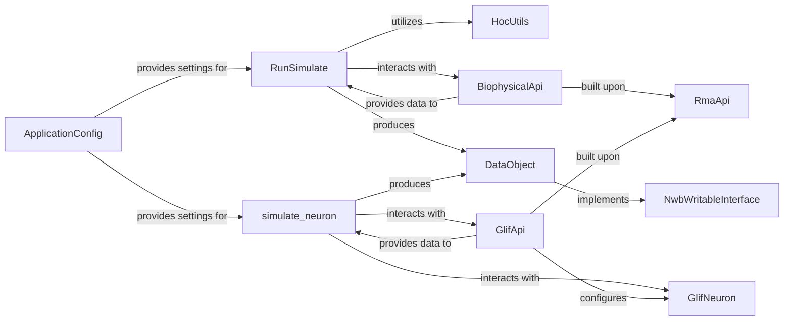

## Details

The `Neuronal Modeling Frameworks` subsystem provides a robust set of tools for constructing, optimizing, and simulating diverse neuronal models. It leverages a layered and modular architecture, with a strong emphasis on data-centric design and adherence to the NWB data standard for interoperability and reproducibility.

### RunSimulate

Orchestrates the simulation of complex biophysical neuronal models using the NEURON environment. It manages the entire workflow, from loading model configurations and experimental data to executing the simulation and handling outputs. This component embodies the "Pipeline/Workflow Pattern" for biophysical simulations.

**Related Classes/Methods**:

- <a href="https://github.com/AllenInstitute/AllenSDK/blob/master/allensdk/model/biophysical/run_simulate.py#L46-L101" target="_blank" rel="noopener noreferrer">`RunSimulate` (46:101)</a>

### GlifNeuron

Represents the Generalized Leaky Integrate-and-Fire (GLIF) neuron model. This class encapsulates the model's parameters, defines its intrinsic dynamics, and provides methods for configuration and state management. It is the fundamental data structure for GLIF models, supporting the "Modular Architecture" by providing a clear model abstraction.

**Related Classes/Methods**:

- <a href="https://github.com/AllenInstitute/AllenSDK/blob/master/allensdk/model/glif/glif_neuron.py#L53-L470" target="_blank" rel="noopener noreferrer">`GlifNeuron` (53:470)</a>

### HocUtils

Provides essential utility functions for interfacing with the NEURON simulation environment, specifically through its HOC (Hotdraw Object Code) language. This component is critical for setting up, configuring, and running complex biophysical simulations that rely on NEURON, acting as a bridge to external simulation software.

**Related Classes/Methods**:

- <a href="https://github.com/AllenInstitute/AllenSDK/blob/master/allensdk/model/biophys_sim/neuron/hoc_utils.py#L38-L94" target="_blank" rel="noopener noreferrer">`HocUtils` (38:94)</a>

### simulate_neuron

A dedicated function responsible for executing simulations of GLIF neuron models. It handles the retrieval of necessary model parameters and experimental data, performs the simulation, and manages the output of the simulation results. This function provides a clear entry point for GLIF model execution.

**Related Classes/Methods**:

- <a href="https://github.com/AllenInstitute/AllenSDK/blob/master/allensdk/model/glif/simulate_neuron.py#L125-L132" target="_blank" rel="noopener noreferrer">`simulate_neuron` (125:132)</a>

### BiophysicalApi

Provides a dedicated API for querying and retrieving biophysical model-specific data from the central data warehouse. It serves as a specialized data access layer, enabling biophysical simulation components to obtain necessary parameters and experimental data, adhering to the "Data-Centric Architecture" and "API Gateway/Client Pattern".

**Related Classes/Methods**:

- <a href="https://github.com/AllenInstitute/AllenSDK/blob/master/allensdk/api/queries/biophysical_api.py#L43-L389" target="_blank" rel="noopener noreferrer">`BiophysicalApi` (43:389)</a>

### GlifApi

Provides a dedicated API for querying and retrieving GLIF model-specific data from the central data warehouse. Similar to `BiophysicalApi`, it acts as a specialized data access layer for GLIF models, ensuring that simulation components can reliably obtain necessary parameters and experimental data.

**Related Classes/Methods**:

- <a href="https://github.com/AllenInstitute/AllenSDK/blob/master/allensdk/api/queries/glif_api.py#L41-L249" target="_blank" rel="noopener noreferrer">`GlifApi` (41:249)</a>

### RmaApi

A general-purpose API for interacting with the Resource Management Application (RMA) system. It serves as a foundational data access layer, providing core data retrieval capabilities that are leveraged by various domain-specific APIs, including `BiophysicalApi` and `GlifApi`. This component is central to the "API Gateway/Client Pattern" for data access.

**Related Classes/Methods**:

- <a href="https://github.com/AllenInstitute/AllenSDK/blob/master/allensdk/api/queries/rma_api.py#L39-L599" target="_blank" rel="noopener noreferrer">`RmaApi` (39:599)</a>

### ApplicationConfig

A foundational component responsible for managing application-wide configurations. It provides a centralized and standardized mechanism for various parts of the SDK, including neuronal simulation modules, to access and manage their operational settings and parameters. This supports the "Modular Architecture" by decoupling configuration from logic.

**Related Classes/Methods**:

- <a href="https://github.com/AllenInstitute/AllenSDK/blob/master/allensdk/config/app/application_config.py#L49-L366" target="_blank" rel="noopener noreferrer">`ApplicationConfig` (49:366)</a>

### DataObject

A fundamental base class for various data objects throughout the SDK. It provides common functionalities for data handling, serialization, and deserialization, ensuring data consistency and compatibility, particularly with the NWB standard. This is crucial for inputs and outputs of modeling, aligning with the "Data-Centric Architecture".

**Related Classes/Methods**:

- <a href="https://github.com/AllenInstitute/AllenSDK/blob/master/allensdk/core/_data_object_base/data_object.py#L8-L176" target="_blank" rel="noopener noreferrer">`DataObject` (8:176)</a>

### NwbWritableInterface

This interface defines the contract and methods for writing data objects to the Neurodata Without Borders (NWB) format. Its widespread implementation across various data objects underscores the SDK's commitment to data standards, interoperability, and reproducibility in neuroinformatics, directly supporting the "Data-Centric Architecture".

**Related Classes/Methods**:

- `NwbWritableInterface` (1:1)

### [FAQ](https://github.com/CodeBoarding/GeneratedOnBoardings/tree/main?tab=readme-ov-file#faq)