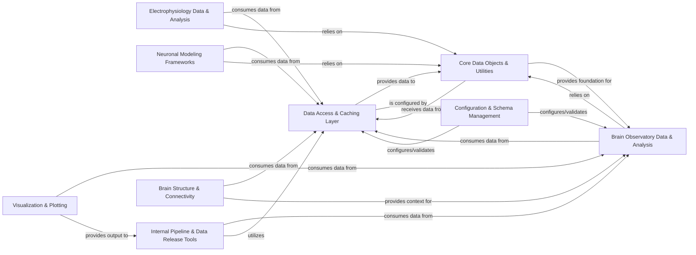

## Details

The AllenSDK is structured as a comprehensive Neuroinformatics Software Development Kit, designed to facilitate neuroscience research through modular, data-centric, and extensible components. The architecture emphasizes clear separation of concerns, robust data access, and domain-specific analysis capabilities, all underpinned by a strong foundation of core utilities and configuration management.

### Data Access & Caching Layer [[Expand]](./Data_Access_Caching_Layer.md)

This foundational layer provides unified and efficient access to various Allen Institute neuroscience datasets (experimental data, metadata, reference spaces). It integrates robust caching mechanisms (local and S3-based) to optimize data retrieval from cloud storage and internal data warehouses (LIMS, Mtrain).

**Related Classes/Methods**:

- <a href="https://github.com/AllenInstitute/AllenSDK/blob/master/allensdk/api/api.py#L52-L393" target="_blank" rel="noopener noreferrer">`allensdk.api.api.Api` (52:393)</a>

- <a href="https://github.com/AllenInstitute/AllenSDK/blob/master/allensdk/api/cloud_cache/cloud_cache.py#L368-L1034" target="_blank" rel="noopener noreferrer">`allensdk.api.cloud_cache.cloud_cache.CloudCacheBase` (368:1034)</a>

- <a href="https://github.com/AllenInstitute/AllenSDK/blob/master/allensdk/core/brain_observatory_cache.py#L79-L819" target="_blank" rel="noopener noreferrer">`allensdk.core.BrainObservatoryCache` (79:819)</a>

- <a href="https://github.com/AllenInstitute/AllenSDK/blob/master/allensdk/brain_observatory/ecephys/ecephys_project_cache.py#L27-L720" target="_blank" rel="noopener noreferrer">`allensdk.brain_observatory.ecephys.ecephys_project_cache.EcephysProjectCache` (27:720)</a>

### Core Data Objects & Utilities [[Expand]](./Core_Data_Objects_Utilities.md)

This component defines fundamental data structures, common utility functions (e.g., for JSON, H5, pickle serialization), and base classes for all data objects within the SDK. It ensures data consistency, facilitates interoperability, and integrates with NWB (Neurodata Without Borders) data standards.

**Related Classes/Methods**:

- <a href="https://github.com/AllenInstitute/AllenSDK/blob/master/allensdk/core/_data_object_base/data_object.py#L8-L176" target="_blank" rel="noopener noreferrer">`allensdk.core._data_object_base.data_object.DataObject` (8:176)</a>

- <a href="https://github.com/AllenInstitute/AllenSDK/blob/master/allensdk/core/brain_observatory_nwb_data_set.py#L104-L945" target="_blank" rel="noopener noreferrer">`allensdk.core.brain_observatory_nwb_data_set.BrainObservatoryNwbDataSet` (104:945)</a>

- <a href="https://github.com/AllenInstitute/AllenSDK/blob/master/allensdk/core/json_utilities.py" target="_blank" rel="noopener noreferrer">`allensdk.core.json_utilities`</a>

- <a href="https://github.com/AllenInstitute/AllenSDK/blob/master/allensdk/core/nwb_data_set.py#L39-L404" target="_blank" rel="noopener noreferrer">`allensdk.core.nwb_data_set.NwbDataSet` (39:404)</a>

### Brain Observatory Data & Analysis [[Expand]](./Brain_Observatory_Data_Analysis.md)

Specialized component for processing, analyzing, and managing data from Brain Observatory experiments (calcium imaging and behavioral data). Includes tools for data loading, preprocessing (motion correction, dFF), stimulus-response analysis, and NWB export.

**Related Classes/Methods**:

- <a href="https://github.com/AllenInstitute/AllenSDK/blob/master/allensdk/brain_observatory/behavior/behavior_ophys_analysis.py#L85-L106" target="_blank" rel="noopener noreferrer">`allensdk.brain_observatory.behavior.behavior_ophys_analysis.BehaviorOphysAnalysis` (85:106)</a>

- <a href="https://github.com/AllenInstitute/AllenSDK/blob/master/allensdk/brain_observatory/behavior/behavior_ophys_experiment.py#L49-L763" target="_blank" rel="noopener noreferrer">`allensdk.brain_observatory.behavior.behavior_ophys_experiment.BehaviorOphysExperiment` (49:763)</a>

- <a href="https://github.com/AllenInstitute/AllenSDK/blob/master/allensdk/brain_observatory/dff.py" target="_blank" rel="noopener noreferrer">`allensdk.brain_observatory.dff`</a>

- <a href="https://github.com/AllenInstitute/AllenSDK/blob/master/allensdk/brain_observatory/stimulus_analysis.py#L47-L648" target="_blank" rel="noopener noreferrer">`allensdk.brain_observatory.stimulus_analysis.StimulusAnalysis` (47:648)</a>

### Electrophysiology Data & Analysis [[Expand]](./Electrophysiology_Data_Analysis.md)

Provides a comprehensive suite of tools for processing, analyzing, and managing electrophysiology (ephys) data. Functionalities include spike sorting, LFP analysis, current source density estimation, and NWB export for ephys datasets.

**Related Classes/Methods**:

- <a href="https://github.com/AllenInstitute/AllenSDK/blob/master/allensdk/ephys/ephys_extractor.py" target="_blank" rel="noopener noreferrer">`allensdk.ephys.ephys_extractor`</a>

- <a href="https://github.com/AllenInstitute/AllenSDK/blob/master/allensdk/ephys/ephys_features.py" target="_blank" rel="noopener noreferrer">`allensdk.ephys.ephys_features`</a>

- <a href="https://github.com/AllenInstitute/AllenSDK/blob/master/allensdk/brain_observatory/ecephys/_current_source_density.py#L7-L76" target="_blank" rel="noopener noreferrer">`allensdk.brain_observatory.ecephys._current_source_density.CurrentSourceDensity` (7:76)</a>

- <a href="https://github.com/AllenInstitute/AllenSDK/blob/master/allensdk/brain_observatory/ecephys/_lfp.py#L8-L105" target="_blank" rel="noopener noreferrer">`allensdk.brain_observatory.ecephys._lfp.LFP` (8:105)</a>

### Neuronal Modeling Frameworks [[Expand]](./Neuronal_Modeling_Frameworks.md)

Offers tools for constructing, optimizing, and simulating various neuronal models, including complex biophysical models (leveraging NEURON) and simplified GLIF models, enabling exploration of neuronal dynamics.

**Related Classes/Methods**:

- <a href="https://github.com/AllenInstitute/AllenSDK/blob/master/allensdk/model/biophysical/run_simulate.py#L46-L101" target="_blank" rel="noopener noreferrer">`allensdk.model.biophysical.run_simulate.RunSimulate` (46:101)</a>

- <a href="https://github.com/AllenInstitute/AllenSDK/blob/master/allensdk/model/biophys_sim/neuron/hoc_utils.py#L38-L94" target="_blank" rel="noopener noreferrer">`allensdk.model.biophys_sim.neuron.hoc_utils.HocUtils` (38:94)</a>

- <a href="https://github.com/AllenInstitute/AllenSDK/blob/master/allensdk/model/glif/simulate_neuron.py#L125-L132" target="_blank" rel="noopener noreferrer">`allensdk.model.glif.simulate_neuron.simulate_neuron` (125:132)</a>

- <a href="https://github.com/AllenInstitute/AllenSDK/blob/master/allensdk/model/glif/glif_neuron.py#L53-L470" target="_blank" rel="noopener noreferrer">`allensdk.model.glif.glif_neuron.GlifNeuron` (53:470)</a>

### Internal Pipeline & Data Release Tools [[Expand]](./Internal_Pipeline_Data_Release_Tools.md)

Internal-facing modules and utilities for automating data processing pipelines, performing quality control, and preparing processed data and associated metadata for public release. Includes metadata writing and data copying.

**Related Classes/Methods**:

- `allensdk.internal.pipeline_modules`

- `allensdk.brain_observatory.behavior.behavior_project_cache.project_metadata_writer`

- `allensdk.brain_observatory.ecephys.write_nwb`

- `allensdk.brain_observatory.ecephys.copy_utility`

### Visualization & Plotting

Collection of specialized tools and functions for generating various plots and visualizations of neuroscience data, aiding researchers in data exploration, quality control, and effective presentation.

**Related Classes/Methods**:

- <a href="https://github.com/AllenInstitute/AllenSDK/blob/master/allensdk/brain_observatory/circle_plots.py#L421-L497" target="_blank" rel="noopener noreferrer">`allensdk.brain_observatory.circle_plots.CoronaPlotter` (421:497)</a>

- <a href="https://github.com/AllenInstitute/AllenSDK/blob/master/allensdk/brain_observatory/observatory_plots.py" target="_blank" rel="noopener noreferrer">`allensdk.brain_observatory.observatory_plots`</a>

- <a href="https://github.com/AllenInstitute/AllenSDK/blob/master/allensdk/internal/ephys/plot_qc_figures.py" target="_blank" rel="noopener noreferrer">`allensdk.internal.ephys.plot_qc_figures`</a>

- <a href="https://github.com/AllenInstitute/AllenSDK/blob/master/allensdk/internal/morphology/morphvis.py" target="_blank" rel="noopener noreferrer">`allensdk.internal.morphology.morphvis`</a>

### Configuration & Schema Management [[Expand]](./Configuration_Schema_Management.md)

Manages the SDK's overall application configuration, including parsing command-line arguments, integrating environment variables, and defining/validating data schemas using `argschema`. Ensures consistent input/output formats and parameter handling.

**Related Classes/Methods**:

- <a href="https://github.com/AllenInstitute/AllenSDK/blob/master/allensdk/config/app/application_config.py#L49-L366" target="_blank" rel="noopener noreferrer">`allensdk.config.app.application_config.ApplicationConfig` (49:366)</a>

- <a href="https://github.com/AllenInstitute/AllenSDK/blob/master/allensdk/config/model/description.py#L40-L131" target="_blank" rel="noopener noreferrer">`allensdk.config.model.description.Description` (40:131)</a>

- <a href="https://github.com/AllenInstitute/AllenSDK/blob/master/allensdk/config/manifest.py#L59-L415" target="_blank" rel="noopener noreferrer">`allensdk.config.manifest.Manifest` (59:415)</a>

- <a href="https://github.com/AllenInstitute/AllenSDK/blob/master/allensdk/brain_observatory/argschema_utilities.py#L109-L111" target="_blank" rel="noopener noreferrer">`allensdk.brain_observatory.argschema_utilities.RaisingSchema` (109:111)</a>

### Brain Structure & Connectivity [[Expand]](./Brain_Structure_Connectivity.md)

Offers tools and data structures for working with brain anatomy, standardized reference spaces, and mouse connectivity data. Enables spatial analysis and visualization of neural data within a consistent anatomical context.

**Related Classes/Methods**:

- <a href="https://github.com/AllenInstitute/AllenSDK/blob/master/allensdk/api/queries/mouse_atlas_api.py#L45-L149" target="_blank" rel="noopener noreferrer">`allensdk.api.queries.mouse_atlas_api.MouseAtlasApi` (45:149)</a>

- <a href="https://github.com/AllenInstitute/AllenSDK/blob/master/allensdk/core/mouse_connectivity_cache.py#L53-L977" target="_blank" rel="noopener noreferrer">`allensdk.core.mouse_connectivity_cache.MouseConnectivityCache` (53:977)</a>

- <a href="https://github.com/AllenInstitute/AllenSDK/blob/master/allensdk/core/reference_space_cache.py#L46-L329" target="_blank" rel="noopener noreferrer">`allensdk.core.reference_space_cache.ReferenceSpaceCache` (46:329)</a>

- <a href="https://github.com/AllenInstitute/AllenSDK/blob/master/allensdk/core/structure_tree.py#L47-L456" target="_blank" rel="noopener noreferrer">`allensdk.core.structure_tree.StructureTree` (47:456)</a>

### [FAQ](https://github.com/CodeBoarding/GeneratedOnBoardings/tree/main?tab=readme-ov-file#faq)